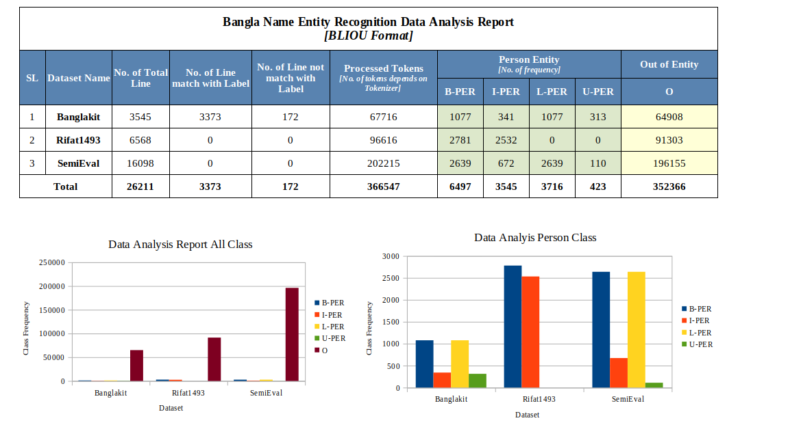
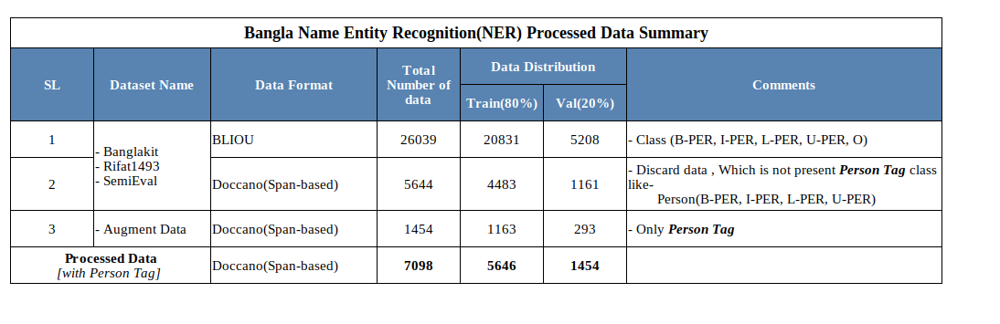
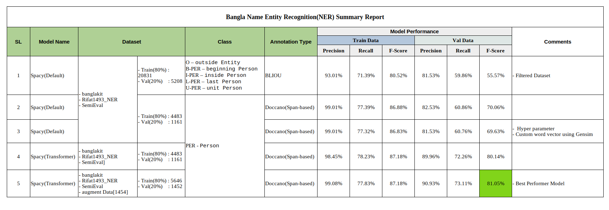

# Bangla_NER
[](https://colab.research.google.com/drive/1uN1WP7MjaBYXKABfhkHGn7EBWm9kd9k9?usp=sharing)

Bangla Name Entity Recognition (NER) is extracting human names from input Bangla string or text. To solve this problem select [Spacy](https://spacy.io/) pipeline and try 5 experimental approaches. 

The experiment is done only using one entity name (person) labeled as PER. After completing the experiment we got the best performance from the spacy transformer-based model.

For more detail please check the [experimental details](docs/experiemts.md) The best model F1 score is ~.81.05. 

    ## Table of Contents
    
    1. Installation
    
    2. Dataset and Data Processing
    
    3. Model Building
    
    4. Model Evaluation
    
    5. Inference
    
    6. Docker
    
    7. End Point API
    
    8. Bert Pipeline[New Experiments]
    
    9. References


# 1. Installation

```
conda create -n bn_ner python=3.8
pip install -r requirements.txt
```

N.B:  if raise  ```CuPy``` error, install ```pip install CuPy==12.3.0``` version for GPU acceleration.

# 2. Dataset and Data Processing
    2.1 EDA Report
    2.2 Processed Data Summary
    2.3 Data Collection Information
    2.4 Data Annotation Information
    2.5 Data Processing

## 2.1 EDA Report




## 2.2 Processed Data Summary



Check the ```training/utils``` folder for the Data processing script. 

## 2.3 Data Collection Information

Bangla NER data is collected from,

1. banglakit Bangla NER Dataset [Link](https://raw.githubusercontent.com/banglakit/bengali-ner-data/master/main.jsonl)

2. Rifat1493 Bangla NER Dataset [Link](https://github.com/Rifat1493/Bengali-NER/tree/master/Input) 


3. SemEval2022 Bangla NER Dataset [Link](https://competitions.codalab.org/competitions/36425#learn_the_details)


raw dataset structure into ```raw_data``` folder,

```
raw_data
├── banglakit
│   └── main.jsonl
├── Rifat1493_NER_txt
│   └── all_data.txt
└── SemiEval
    ├── bn_dev.json
    ├── bn_train.json
    └── statistics.md
```


## 2.4 Data Annotation Information

Please Check the annotation structure and information about the Bangla NER dataset [check](docs/data_info.md)

## 2.5 Data Processing


Data processing approach,

    2.5.1 Raw Data Processing
    2.5.2 Span Based Data Processing(Doccano NER format)
    2.5.3 Augment Data Generation
    2.5.4 Preparing Training Spacy Format
    

<!-- This [IOB-tagging](https://en.wikipedia.org/wiki/Inside%E2%80%93outside%E2%80%93beginning_(tagging)) dataset needs to filter because some lines match with its label and some do not match. -->
## 2.5.1 Raw Data Processing
Raw data processing steps:

    - Exclude other classes without PERSON Class(PER)

    - Discard the dataset not matching with label

    - Clean IOB and remove data that is in the wrong IOB format

    - Minimal data removal which is logically valid and matching token.  

    - BLIOU Annotation checking and correction

    - Data Distribution training (80%) and validation (20%)

    - Randomly data shuffle - 4 times

Get for information about ```BLIOU``` format please check [Example](https://github.com/explosion/spaCy/blob/v2.3.5/examples/training/ner_example_data/ner-token-per-line.json)


For processing steps please check the script ```utils/data_processing.py``` line number ```443``` to ```445``` dataset path directory, 

__input__:
```sh
# make sure the input dataset path
banglakit= "./data/raw_data/banglakit/main.jsonl"
rifat1493 = "./data/raw_data/Rifat1493_NER_txt/all_data.txt"
semieval = "./data/raw_data/SemiEval"

```

Register the data line number ```453```,

``` sh
register_dataset = {
    "BanglakitNER"   : banglakit,
    "Rifat1493BnNER" : rifat1493,
    "SemiEvalBnNER"  : semieval_files
}
```

__N.B: if any dataset is not possible to collect, avoid the data assigning into the register field. data will be processed which have registered.__


Run
```
python utils/data_processing.py

```
Output,
```sh
No. of Training data: 20831
No. of Validation data: 5208

```
__Data Save directory__,

```sh
data
└── ner_bliou_processed_data
    ├── train.json
    └── val.json
```

## 2.5.2 Span-Based Data Processing(Doccano NER format)

Make sure input and output path directory into script ```python utils/conversion_bliou_to_span_format.py```line number ```201```,

```sh
#make sure the input path directory
data_path = "./data/ner_bliou_processed_data"
#make sure output path directory  
output_dir = "./data/ner_spanbased_process_data"
```

output : 
``` sh
processed file : ./data/ner_spanbased_process_data/train.jsonl
Total number of lines: 20831
Person Tag Found: 4483

processed file : ./data/ner_spanbased_process_data/val.jsonl
Total number of lines: 5208
Person Tag Found: 1161
```
Annotation structure,

```
{"text": "অ্যাভনার ফ্রিডম্যান (জন্ম ১৯৩২), আংশিক পার্থক্য সমীকরণ", "label": [[0, 19, "PER"]]}
{"text": "এটি ১৯১৪ সালে এডওয়ার্ড মেয়ারিক দ্বারা বর্ণনা করা হয়েছিল।", "label": [[14, 32, "PER"]]}
{"text": "আমার কাছে একটি সুদৃশ্য ল্যাপ স্টিল ছিল যা ডেভিড লিন্ডলি বেছে নিয়েছিল।", "label": [[42, 55, "PER"]]}
```

For more details about the Doccano annotation format please check [link](https://doccano.github.io/doccano/tutorial/)


## 2.5.3 Augment Data Generation

Generate augment data 25.79% compared with original data[5644]. So the number of augmented data is 1454 and distributed as training[80%]  ```1163```  and validation[20%] ```293```.

Proposed Approach,
- Scraping human name data from several websites
- Replace the name into the text string using span position(starting and ending) and update the IOU span of the text.

Explanation,

Original Data,
```
{"text": "তিনি মোহাম্মদ বাকির আল-সদর এর ছাত্র ছিলেন।", "label": [[5, 26, "PER"]]}
```

Augmented Data,
```
{"text": "তিনি সাইফুল ইসলাম এর ছাত্র ছিলেন।", "label": [[5, 17, "PER"]]}
```
replace the the human name ```মোহাম্মদ বাকির আল-সদর``` using name ```সাইফুল ইসলাম``` and generate augment data.

## 2.5.4 Preparing Training Spacy Format

Convert process data to spacy format and make sure data path into script ```utils/conversion_spacy_format.py```,

``` sh
# input path dir
input_dir = "./data/ner_spanbased_process_data"
# output path dir
output_dir = "./data/ner_spanbased_process_data"
```

Output:
``` sh

# convert train data to spacy format and save the dir
Spacy Processed file   : ./data/ner_spanbased_process_data/train.spacy
No. of Processed line: 4483
# None span found 
No. of Skip Entity: 11

# convert val data to spacy format and save the dir
Spacy Processed file   : ./data/ner_spanbased_process_data/val.spacy
No. of Processed line: 1146
# None span found
No. of Skip Entity  : 3
```

check the annotation visualization [notebook](../training/example/data_annotation_visulization.ipynb)

All the processing is complete, let's accelerate the model training.


N.B: if you want to train the spacy ner pipeline using BLIOU format, run below the command,

```sh
Data conversion command for BLIOU, Convert `BLIOU` JSON format to `.spacy` data format

python -m spacy convert data/bangla_ner_data/train.json ./data
python -m spacy convert data/bangla_ner_data/val.json ./data

```


# 3 Model Building

## Training Spacy Pipeline

Please check the training strategy and procedure [here](docs/spacy.md)

or colab know about into colab check,

[](https://colab.research.google.com/drive/1YU7WXkpdwwmFSwPtZGuzlKgntqmZlALF)


# 4 Model Evaluation

__Model Performance Summary__



For more details check [report](./report/Bangla_NER_report_20231209.xlsx)

Make sure the data annotation path and run the ```eval.py``` script.


__N.B: If any issue occurs for model download, please download manually from [here](https://huggingface.co/saiful9379/BanglaNER/tree/main) and place it into ```inference/models folder__

```
python eval.py

```
For more information check The [experimental details](docs/experiemts.md)


# 5 Inference

For the inference, run the ```inference.py``` script the model will download from huggingface and save it in the "inference/models" folder. for manual downloading, check the Model Evaluation N.B section.
run,

```py
python inference.py
```
Or Check the colab for instance inference,


[](https://colab.research.google.com/drive/1uN1WP7MjaBYXKABfhkHGn7EBWm9kd9k9?usp=sharing)


Code Example,

```py
import spacy

# Load English tokenizer, tagger, parser and NER
nlp = spacy.load("models/bangla_ner_model/model-best")

text_list = [
    "আব্দুর রহিম নামের কাস্টমারকে একশ টাকা বাকি দিলাম",
    "নতুন বছরে জ্বলছেন আরও একজন—রজার ফেদেরার ।",
    "ডিপিডিসির স্পেশাল টাস্কফোর্সের প্রধান মুনীর চৌধুরী জানান",
    "তিনি মোহাম্মদ বাকির আল-সদর এর ছাত্র ছিলেন।",
    "লিশ ট্র্যাক তৈরির সময় বেশ কয়েকজন শিল্পীর দ্বারা অনুপ্রাণিত হওয়ার কথা স্মরণ করেন, বিশেষ করে ফ্রাঙ্ক সিনাত্রা ।",
]
for text in text_list:
    doc = nlp(text)
    print(f"Input: {text}")
    for entity in doc.ents:
        print(f"Entity: {entity.text}, Label: {entity.label_}")
    print("---")

```
__Ouptut__

```sh
Input: আব্দুর রহিম নামের কাস্টমারকে একশ টাকা বাকি দিলাম
Entity: আব্দুর রহিম, Label: PER
---
Input: নতুন বছরে জ্বলছেন আরও একজন—রজার ফেদেরার ।
---
Input: ডিপিডিসির স্পেশাল টাস্কফোর্সের প্রধান মুনীর চৌধুরী জানান
Entity: মুনীর চৌধুরী, Label: PER
---
Input: তিনি মোহাম্মদ বাকির আল-সদর এর ছাত্র ছিলেন।
Entity: মোহাম্মদ বাকির আল-সদর, Label: PER
---
Input: লিশ ট্র্যাক তৈরির সময় বেশ কয়েকজন শিল্পীর দ্বারা অনুপ্রাণিত হওয়ার কথা স্মরণ করেন, বিশেষ করে ফ্রাঙ্ক সিনাত্রা ।
Entity: ফ্রাঙ্ক সিনাত্রা, Label: PER
```
Or 

inference notebook [check](training/example/interence.ipynb)

# 6 Docker

## Docker install

For docker install please [check](https://www.digitalocean.com/community/tutorials/how-to-install-and-use-docker-on-ubuntu-20-04)


## Docker Build

```
sudo docker build -t bangla_ner.
```
Check the Docker image and image ID,

```
sudo docker images
```
Output,
```sh
REPOSITORY      TAG                                 IMAGE ID       CREATED          SIZE
bangla_ner      latest                              c34a96d16f48   4 minutes ago    ...GB

```

For CPU run,

```sh
# run it first
sudo docker run -it -p 5000:5000 bangla_ner /bin/bash
# go inference directory
cd inference/
# run 
python3 app.py
```
After running the app file output shows IP-Address looks like,

```sh
 * Running on all addresses (0.0.0.0)
 * Running on http://127.0.0.1:8008
 * Running on http://172.17.0.2:8008
```
__N.B: For API request and docker inference, Take the last ip and change the ```End Point API``` request url ```http://localhost:8008/ner"``` using this ```http://172.17.0.2:8008```. this approch only for inside docker API request purposes. otherwise no need to change ```End Point API```__ 


# 7 End Point API(Application Programming Interface)

Some instruction as inference section. run ```app.py``` model will download and the server will run.

For more details about API requests, please [check](docs/end_point.md)

# 8 Bert Pipeline[Experiment]

Bert Model F1 score is ~.80

__Inference Pipeline :__ [huggingface](https://huggingface.co/saiful9379/BanglaNER_BERT)
__Training Pipeline :__ [](https://colab.research.google.com/drive/1U7DfMarUE61fFyzdWldpzWO7rm5EQRmQ)

```py
import torch 
from transformers import BertTokenizerFast, BertConfig, BertForTokenClassification
device = 'cuda' if torch.cuda.is_available() else 'cpu'

MAX_LEN = 512
labels_to_ids = {'O': 0, 'B-PER': 1, 'L-PER': 2, 'I-PER': 3, 'U-PER': 4}

ids_to_labels = {value:key for key, value in labels_to_ids.items()}

tokenizer = BertTokenizerFast.from_pretrained('saiful9379/BanglaNER_BERT')
model = BertForTokenClassification.from_pretrained('saiful9379/BanglaNER_BERT', num_labels=len(labels_to_ids))
model.to(device)

text_list = [
    ": আল স্কিনিয়ার গিটার, পিয়ানো, ভোকাল, মগ সিনথেসাইজার",
    "আব্দুর রহিম নামের কাস্টমারকে একশ টাকা বাকি দিলাম",
    "রহিম নামের কাস্টমারকে একশ টাকা বাকি দিলাম",
    "সাইফুল ইসলাম ন্যাচারাল ল্যাঙ্গুয়েজে প্রসেসিং খুব বেশি ভালো পারে না । তাই সে বেশি বেশি স্টাডি করতেছে।",
    "ডিপিডিসির স্পেশাল টাস্কফোর্সের প্রধান মুনীর চৌধুরী জানান",
    "তিনি মোহাম্মদ বাকির আল-সদর এর ছাত্র ছিলেন।",
    "লিশ ট্র্যাক তৈরির সময় বেশ কয়েকজন শিল্পীর দ্বারা অনুপ্রাণিত হওয়ার কথা স্মরণ করেন, বিশেষ করে ফ্রাঙ্ক সিনাত্রা ।",
]

def inference(sentence):
  inputs = tokenizer(sentence, padding='max_length', truncation=True, max_length=MAX_LEN, return_tensors="pt")

  # move to gpu
  ids = inputs["input_ids"].to(device)
  mask = inputs["attention_mask"].to(device)
  # forward pass
  outputs = model(ids, mask)
  logits = outputs[0]

  active_logits = logits.view(-1, model.num_labels) # shape (batch_size * seq_len, num_labels)
  flattened_predictions = torch.argmax(active_logits, axis=1) # shape (batch_size*seq_len,) - predictions at the token level

  tokens = tokenizer.convert_ids_to_tokens(ids.squeeze().tolist())
  token_predictions = [ids_to_labels[i] for i in flattened_predictions.cpu().numpy()]
  wp_preds = list(zip(tokens, token_predictions)) # list of tuples. Each tuple = (wordpiece, prediction)

  word_level_predictions = []
  for pair in wp_preds:
    if (pair[0].startswith(" ##")) or (pair[0] in ['[CLS]', '[SEP]', '[PAD]']):
      # skip prediction
      continue
    else:
      word_level_predictions.append(pair[1])

  str_rep = " ".join([t[0] for t in wp_preds if t[0] not in ['[CLS]', '[SEP]', '[PAD]']]).replace(" ##", "")
  print(str_rep)
  print(wp_preds)
  print(word_level_predictions)
  print("="*30)
```
__N.B : BERT Pipeline add readme (13/12/2023)__

# 9 Reference

1. [Spacy Training Pipelines & Models](https://spacy.io/usage/training)
2. [NER data annotation](https://doccano.github.io/doccano/tutorial/)

3. [BERT Pretrin model ](https://github.com/csebuetnlp/banglabert)
4. [BILOU data formats meaning](https://stackoverflow.com/questions/17116446/what-do-the-bilou-tags-mean-in-named-entity-recognition)
5. [SpaCy 3.1 data format](https://zachlim98.github.io/me/2021-03/spacy3-ner-tutorial)
6. [Tranformer infornation](https://jalammar.github.io/illustrated-transformer/)
7. [Load Gensim WordVectors into spacy pipeline](https://stackoverflow.com/questions/75521069/load-gensim-wordvectors-into-spacy-pipeline)
8. [Postman ](https://www.postman.com/)
9. [curl request](https://curl.se/docs/httpscripting.html)


