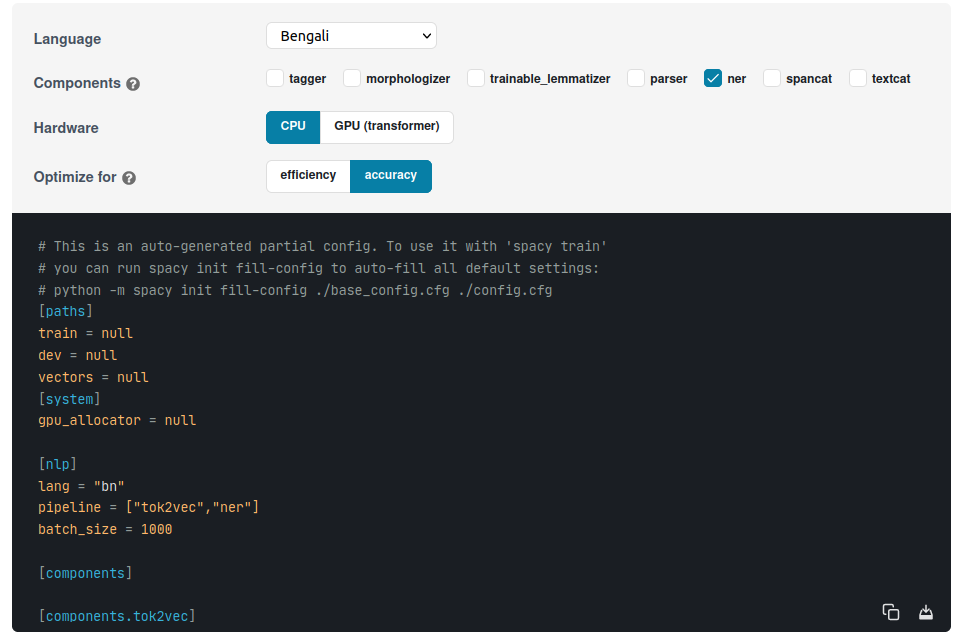

# Bangla NER using Spacy

- Pipeline configuration
- Data processing
- Model Training
- Evaluation
- Inference

## Pipeline configuration

Training the spacy pipeline needs to config from the spacy [link](https://spacy.io/usage/training). The configuration screenshot shows the different components as well as Hardware compatibility.
we have chosen both CPU and GPU and saved it ```config``` folder. 




__Config folder structure__

```sh
configs/
├── base_config_cpu.cfg # base CPU pipeline ner file configuration download from the spacy website
├── base_config_gpu.cfg # base GPU pipeline ner file configuration download from the spacy website
└── config.cfg          # use to train configuration
```


## Prepare configuration files

Run the command for base_config file to train able config file,

CPU, 
```
python -m spacy init fill-config configs/base_config_cpu.cfg configs/config.cfg
```
GPU
```
python -m spacy init fill-config configs/base_config_gpu.cfg configs/config.cfg
```

## Data processing

Data processing already discuss into ```Dataset``` section, if you need more please [check](data_processing.md)

## Model Training

Make sure the configuration file ```configs/config_cpu.cfg``` as well as dataset path processed ```.spacy``` format.


### __Spacy default Pipeline(CPU based)__

Directly go to spacy cpu training notebook  : [check](../training/example/BanglaNER_Using_Spacy_CPU.ipynb)

[](https://colab.research.google.com/drive/1DZbFzB3V6I1fueIQxDfxGhW11_m8LVtq)

```sh
bash train_cpu.sh
```
or 
```sh
python -m spacy train configs/config_cpu.cfg \
    --output ./models/bangla_ner_model_v1 \
    --paths.train ./data/ner_spanbased_process_data/train.spacy \
    --paths.dev ./data/ner_spanbased_process_data/val.spacy

```
if want to review training logs please [check](spacy_cpu_train_log.md)


### __Spacy transformer Based Pipeline(GPU)__

Directly go to spacy transformer-based GPU training notebook  : [check](../training/example/BanglaNER_Spacy(transformer).ipynb)

[](https://colab.research.google.com/drive/1YU7WXkpdwwmFSwPtZGuzlKgntqmZlALF?usp=sharing)

```sh
bash train_gpu.sh
```
or 

```sh
python -m spacy train configs/config.cfg \
    --gpu-id 0 \
    --output ./models/bangla_ner_model_v4 \
    --paths.train ./data/bangla_ner_span_based/train.spacy \
    --paths.dev ./data/bangla_ner_span_based/train.spacy
```
if want to review training logs please [check](spacy_gpu_training_logs.md)

## Evalution

The Spacy-Based Pipeline evaluates the model using ```[stating, ending]``` as well as the predicted class.

More sure model path and input data with span based annotation,


Example:
```sh
# model path
model_path = "./models/bangla_ner_model_v1/model-best"
# data path directory
data_path = "./data/ner_spanbased_process_data/val.jsonl"
```

run,

```
python eval.py
```

## Inference

```py
# pip install -U spacy
import spacy

# Load English tokenizer, tagger, parser and NER
nlp = spacy.load("models/bangla_ner_model/model-best")

text_list = [
    "আব্দুর রহিম নামের কাস্টমারকে একশ টাকা বাকি দিলাম",
    ]
for text in text_list:
    doc = nlp(text)
    print(f"Input: {text}")
    for entity in doc.ents:
        print(f"Entity: {entity.text}, Label: {entity.label_}")
    print("---")

```

